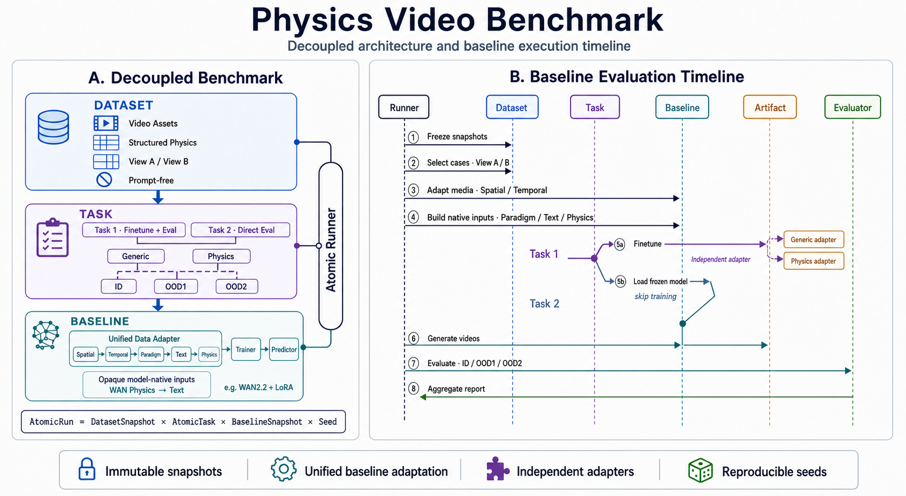

# Benchmark v2：Dataset × Task × Baseline



## 1. 核心关系

Benchmark 只有三个可配置的领域要素：

- **Dataset**：声明客观资产与结构化事实；
- **Task**：声明从 Dataset 中选择哪些 case，以及执行何种实验；
- **Baseline**：声明模型、算法，以及如何把模型无关任务编译成自身可执行任务。

TaskBuilder、DataAdapter、Trainer、Predictor、评测器、缓存和运行器都是上述三者的实现
机制，不构成第四个领域要素。完整编译与执行链为：

```text
TaskSpec
   │  Benchmark 核心结合 DatasetSnapshot 解析 View A / View B
   ▼
CanonicalTaskPlan
   │  目标 Baseline 内置 TaskBuilder 编译
   ▼
BaselineTaskInstance
   │  目标 Baseline 执行
   ▼
AtomicRun
```

对应关系可写为：

```text
CanonicalTaskPlan = Plan(DatasetSnapshot, TaskSpec)
BaselineTaskInstance = Baseline.TaskBuilder.compile(
    DatasetSnapshot,
    TaskSpec,
    CanonicalTaskPlan,
)
AtomicRun = Execute(BaselineTaskInstance)
```

这里有意把“选择什么数据”与“模型如何消费数据”分开。所有 Baseline 先得到相同的
`CanonicalTaskPlan`，因此不能在私有适配阶段静默改变训练集、ID/OOD partition 或
seed；随后各 Baseline 才把该计划编译为自己的可执行实例。

## 2. Dataset

v2 Dataset release 位于 `datasets/physics_video/releases/2.0.0/`，共享的不可变媒体
位于 `datasets/physics_video/assets/`。每条 case 只保留：

- 视频、首帧、参考视频等资产引用；
- `physics` 结构化物理标注；
- appearance、temporal、alignment、provenance；
- OOD1 的资产属性和父子关系。

`cases.jsonl` 禁止出现 `prompt`、`text`、`input_views`、`view_a_split` 和
`physical_parameters`。View A/B 是 Dataset 的独立索引文件，不嵌入原子 case：

- View A 供 `finetune_eval` 选择 train、test_id、test_ood1，必要时动态构造 OOD2；
- View B 供 `direct_eval` 按 scene/group 或显式 case ID 选择评测集。

旧数据没有被覆盖；`scripts/migrate_dataset_v2.py` 可确定性地从 v1 重新生成 v2，
并记录 `migration_audit.json`。

## 3. TaskSpec 与 CanonicalTaskPlan

Task 是以下笛卡尔积中的一个原子项：

| family | conditioning | 训练 | Dataset view |
|---|---|---:|---|
| `finetune_eval` | `generic` | 是 | View A |
| `finetune_eval` | `physics` | 是 | View A |
| `direct_eval` | `generic` | 否 | View B |
| `direct_eval` | `physics` | 否 | View B |

一个 AtomicTask 只有一种 conditioning。`finetune_eval` 还必须且只能包含一个训练
seed；多个训练 seed 应展开为多个 AtomicRun。

Benchmark 核心的 `plan_atomic_task()` 将 `DatasetSnapshot + TaskSpec` 解析为模型无关
的 `CanonicalTaskPlan`，其中冻结：

- Dataset ID 与 digest；
- task family、conditioning 和 scene；
- `train_case_ids`；
- training seed；
- 每个推理 job 的 case、partition、conditioning 与 seed。

`matrix-run` 可以成对启动 generic/physics，但会先验证两者的 Dataset、训练 case、
评测 case、partition 和 seed 完全相同。第一类任务的 generic 与 physics 仍然是两个
独立 run，因此各自拥有独立的训练 metadata、Adapter、loss、日志和预测目录。

OOD2 是相对于 Task 训练域计算出的 partition，不写入 Dataset case 的永久标签。

## 4. Baseline 与内置 TaskBuilder

静态 WAN Baseline bundle 位于 `baselines/wan22_lora/`。Baseline 的顶层组件为：

```text
Baseline
├── TaskBuilder
│   └── DataAdapter
├── Trainer
└── Predictor
```

`TaskBuilder` 是 Baseline 的强制内置编译器，也是核心运行器进入 Baseline 的任务构建
入口。它输入 `DatasetSnapshot + TaskSpec`，由 Benchmark 核心先生成
`CanonicalTaskPlan`，再完成：

1. 校验任务 family、conditioning、scene 和 checkpoint 兼容性；
2. 调用 Baseline 私有 DataAdapter 适配 train/eval case；
3. 组装 training spec 与 inference jobs；
4. 用符号模型引用连接训练和推理；
5. 生成 operation DAG 与缓存绑定；
6. 产出并封印不可变的 `BaselineTaskInstance`。

TaskBuilder 构建过程是确定、无副作用的：它不编码媒体、不训练、不推理。实际副作用只
发生在 `BaselinePlugin.run_task(instance=...)`。

DataAdapter 不再是 Baseline 顶层公共组件，而是 TaskBuilder 的内部实现细节。它统一
负责五个阶段：

1. spatial：分辨率、宽高比与分桶；
2. temporal：物理时间、帧率与帧数；
3. paradigm：T2V、I2V、V2V 等输入范式所需资产；
4. text：只描述物理过程，不包含详细结构化物理参数；
5. physics：把结构化物理信息转换为当前 Baseline 支持的原生注入载荷。

`physics` 阶段的输出对 Benchmark 是 opaque 的。WAN 使用
`append_structured_values_to_text`，其他 Baseline 可以输出数值 token、控制张量、
额外 cross-attention context 或其他模型原生结构。

WAN 的配置和模板实际位于：

```text
baselines/wan22_lora/
├── baseline.json
└── task_builder/
    └── data_adapter/
        └── profiles/
            ├── generic.json
            └── physics.json
```

## 5. 不可变 BaselineTaskInstance

`BaselineTaskInstance` 是一次运行真正的模型可执行边界。其公共 envelope 包含：

- `identity`：Dataset、Task、Baseline、TaskBuilder、DataAdapter 及各 digest；
- `semantics`：family、conditioning、scene；
- `canonical_plan`：未经 Baseline 重新解释的核心计划；
- `source`：本任务实际涉及的 case 与资产根目录；
- `adaptations`：可审计的模型侧适配记录；
- `training`：训练操作；`direct_eval` 时为 `null`；
- `inference.jobs`：带 opaque `native_inputs` 的模型原生推理任务；
- `execution_graph`：训练、推理、评测之间的 operation DAG；
- `cache_bindings`：不可变派生缓存绑定；
- `baseline_payload`：仅目标 Baseline 解释的私有载荷；
- `instance_digest`：封印整个实例的 SHA-256。

封印时先对不含 `instance_digest` 的 canonical JSON 求 SHA-256，再将 digest 写回
文档。实例每次读取都返回新的 JSON 对象，执行前还会重新校验 digest，因此执行器不能
无痕修改已审核的任务。

operation DAG 对两类任务分别是：

```text
finetune_eval: train ──> infer ──> evaluate
direct_eval:              infer ──> evaluate
```

训练产物不以临时绝对路径耦合下游 job，而使用符号引用：

```text
artifact://train/model   # 本实例 train operation 的模型产物
baseline://frozen_model  # Baseline bundle 声明的冻结模型
```

执行器在运行时解析这些引用。这样 TaskBuilder 无须预知 run 目录，实例也可在真正执行
前独立构建、审计和存档。

## 6. 数据适配与缓存

WAN 使用共享、不可变的内容寻址派生缓存：

```text
cache/baselines/<baseline_id>/<materialization_fingerprint>/<dataset_digest>/
```

generic/physics 两个 Task 使用相同 Dataset 和媒体适配策略时复用标准化视频、首帧和
参考视频。原始 Dataset 资产不会被改写。实现记录：

- `data_adapter_fingerprint`：五个阶段及其配置的完整指纹；
- `materialization_fingerprint`：只覆盖 spatial、temporal、paradigm；
- `task_builder_fingerprint`：DataAdapter、Trainer、Predictor 与模型配置的编译器指纹；
- `task_instance_digest`：某次编译所得完整任务实例的内容摘要。

因此改变文本模板或物理注入策略会改变实验指纹和任务实例，却不会无谓重编码完全相同
的媒体；改变 FPS、分辨率或输入范式则会产生新的媒体缓存路径。

## 7. 实际代码与目录边界

```text
physics_video_benchmark/
├── datasets/physics_video/
│   ├── assets/                           # 共享的不可变权威资产
│   ├── provenance/                       # 导入、来源和人工审核记录
│   └── releases/2.0.0/                   # DatasetSnapshot 元数据与资产锁
├── tasks/official/                      # TaskSpec
├── baselines/wan22_lora/
│   ├── baseline.json                    # Baseline bundle
│   └── task_builder/data_adapter/       # WAN 私有适配资源
├── schemas/v2/
│   ├── baseline.schema.json
│   └── baseline_task_instance.schema.json
└── src/physbench/
    ├── tasks/planner.py                 # 核心 CanonicalTaskPlan
    ├── domain/contracts.py              # BaselineTaskInstance 封印契约
    ├── baseline_api/interfaces.py       # TaskBuilder / DataAdapter / Plugin
    ├── baseline_plugins/wan22.py        # WAN TaskBuilder 与执行桥
    └── orchestration/atomic_runner.py   # build、freeze、execute、evaluate
```

一个新的 AtomicRun 会冻结如下关键产物：

```text
<run_dir>/
├── frozen/
│   ├── dataset.json
│   ├── cases.jsonl
│   ├── views.json
│   ├── task.json
│   └── baseline.json
├── plan.json
├── task_builder.json
├── data_adapter.json
├── component_fingerprints.json
├── task_instance/
│   ├── manifest.json
│   ├── canonical_plan.json
│   ├── adaptations.jsonl
│   ├── training.json
│   ├── inference_jobs.jsonl
│   ├── execution_graph.json
│   ├── cache_bindings.json
│   └── baseline_payload.json
├── training/
├── jobs/
├── predictions.jsonl
└── evaluation/
```

## 8. 命令

校验 Dataset：

```bash
PYTHONPATH=src python3 -m physbench validate-dataset \
  --dataset datasets/physics_video/releases/2.0.0/dataset.json \
  --check-assets
```

仅编译并导出可审核的任务实例，不进行训练或推理：

```bash
PYTHONPATH=src python3 -m physbench task-build \
  --dataset datasets/physics_video/releases/2.0.0/dataset.json \
  --task tasks/official/finetune_eval_physics.json \
  --baseline baselines/wan22_lora/baseline.json \
  --output /tmp/wan22_task_instance.json
```

构建、冻结并执行一个 AtomicRun：

```bash
PYTHONPATH=src python3 -m physbench atomic-run \
  --dataset datasets/physics_video/releases/2.0.0/dataset.json \
  --task tasks/official/finetune_eval_generic.json \
  --baseline baselines/wan22_lora/baseline.json \
  --output-root runs_v2
```

命令默认 dry-run；确认实例和冻结计划后加入 `--execute` 才会真正训练和推理。

成对训练两个独立 Adapter：

```bash
PYTHONPATH=src python3 -m physbench matrix-run \
  --dataset datasets/physics_video/releases/2.0.0/dataset.json \
  --task tasks/official/finetune_eval_generic.json \
  --task tasks/official/finetune_eval_physics.json \
  --baseline baselines/wan22_lora/baseline.json \
  --matrix-id wan22_three_scene_generic_vs_physics \
  --output-root runs_v2
```

直接评测指定 case：

```bash
PYTHONPATH=src python3 -m physbench atomic-run \
  --dataset datasets/physics_video/releases/2.0.0/dataset.json \
  --task tasks/official/direct_eval_physics.json \
  --baseline baselines/wan22_lora/baseline.json \
  --case-id <case_id> \
  --output-root runs_v2
```

也可用重复的 `--scene-id` 或 `--group` 覆盖 direct-eval 的选择范围。覆盖先形成有效
Task snapshot 和新 digest，再进入相同 TaskBuilder 编译链。

## 9. 兼容策略

- `datasets/physics_video/releases/1.0.0/`、`configs/`、原
  `src/physbench/runner.py` 和 `runs/` 提供 v1 兼容；
- `datasets/physics_video/releases/2.0.0/`、`tasks/`、`baselines/` 和
  `runs_v2/` 属于 v2；
- `datasets/` 是唯一权威数据根，不再维护平行的 `data/`；
- v1 历史 runs 保持只读；
- v2 的 WAN 插件内部仍可生成 `frozen_cases.jsonl` 和 `resolved_prompts.jsonl`，
  作为已验证旧训练/推理入口的私有兼容投影；
- 核心运行器、TaskBuilder 契约和评测器不依赖这些 WAN 私有文件。

更完整的编译契约见 [TaskBuilder 架构](TASK_BUILDER_ARCHITECTURE.md)，五阶段适配细节见
[统一 DataAdapter 架构](DATA_ADAPTER_ARCHITECTURE.md)。
